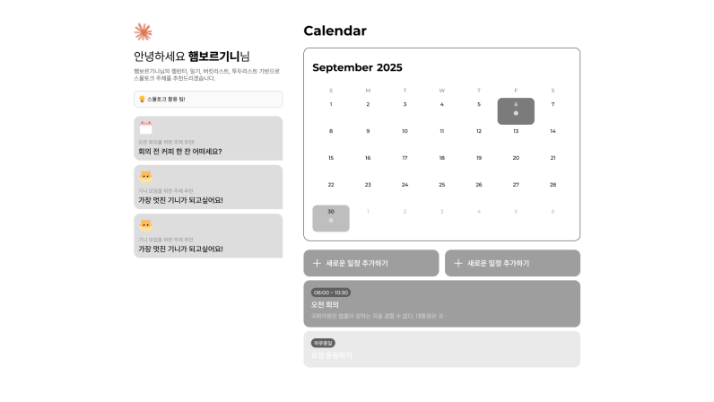

# 📅 2025-09-15

> **트로피칼** 프로젝트

## 🧭 오늘 작업한 주요 내용
* 프론트엔드 CSS 및 컴포넌트 설계

## 🚩 내일 작업할 내용

* 리액트 컴포넌트 생성 완료
* AI 스몰토크 기능 개발 착수

---

## ✅ 프론트엔드 CSS 및 컴포넌트 설계

* **메인 대시보드(스몰토크 영역 고정, 캘린더 영역)**
    * 와이어프레임에 맞춰 프론트엔드 개발 전 공통 css, 컴포넌트를 설계했다.
    * 레이아웃 구조 설계 시 스몰토크 영역은 왼쪽에 고정했다.
    
    * 캘린더 및 일기 / 투두 / 버킷리스트는 오른쪽 영역에서 변경된다.
    * 각 화면은 100vh의 높이를 가지고 내부에서 스크롤 되게 만들었다.

---

## 💭 9/15 일 회고   
9/12 ~ 9/15 동안 프론트엔드 작업을 위해 미리 컴포넌트와 공통 CSS를 설계했다. 이번 경험을 통해 다음 프로젝트에서는 색상, 폰트 등 UI 세부 요소를 사전에 충분히 논의하고 진행해야겠다고 느꼈다. 큰 틀만 정해지고 세부 요소 논의가 부족하다 보니, 설계 과정에서 불필요하게 많은 시간을 소모하게 되었다.