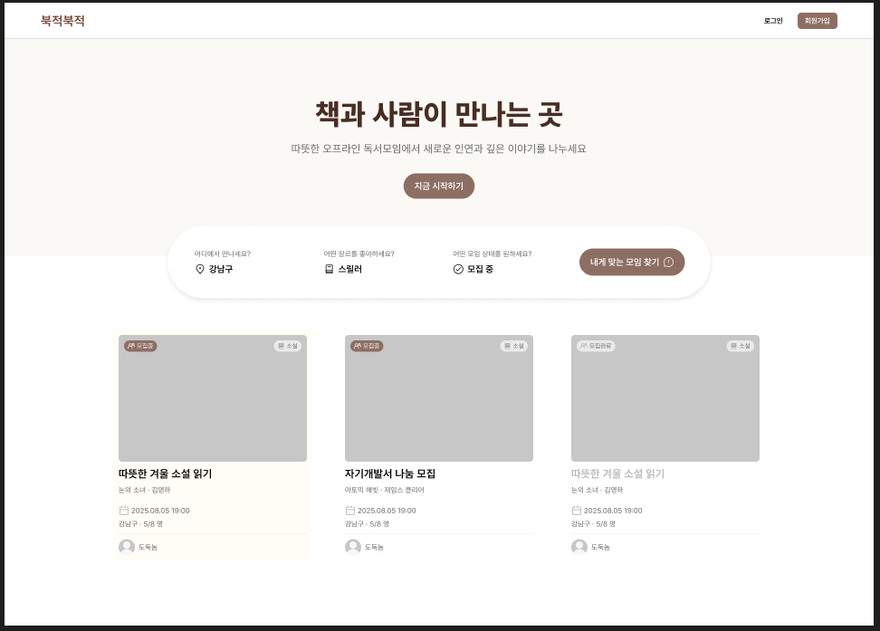
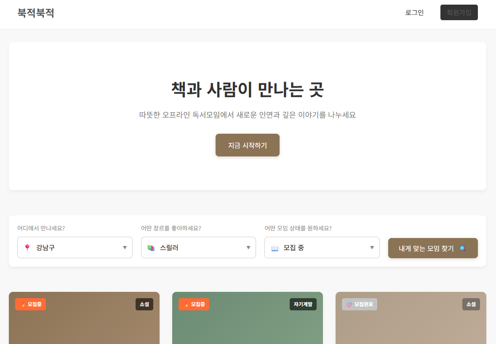

# 📅 2025-08-08 회고

> **북적북적(BookJuk)** UXUI 파일 초안 생성

## 🧭 오늘 논의한 주요 내용

* 작성한 시나리오 바탕으로 UXUI 파일 생성
* API 명세서 작성

---

## ✅ UXUI 파일 생성
팀원별 담당 시나리오 작성 후 취합하여 UXUI 프롬프트를 생성, AI를 통해 프로토타입을 만들었다.   
AI를 통해 생성한 프로토타입의 디자인을 참고하여 피그마 문서로 디자인을 다시 생성했다.
생성한 디자인을 바탕으로 클로드와 제미나이를 활용하여 html/css/js 파일을 생성했다.   
생성한 파일은 팀원이 각자 담당한 화면 기능에 맞게 코드를 추가, 수정하는 방향으로 결정했다.   

피그마 툴로 만든 디자인 초안.    

AI 툴로 생성한 디자인 코드 문서   

---

## 💭 8/8 일 회고
AI를 돌려서 디자인 프로토타입을 만들 수 있다는 것이 신기했다.   
사용자 시나리오를 구체적으로 작성하고 프롬프트도 구체적으로 작성해도   
정리한 화면대로 나오지 않아서 아직까지는 사람이 필요하다는 것을 느꼈다.
