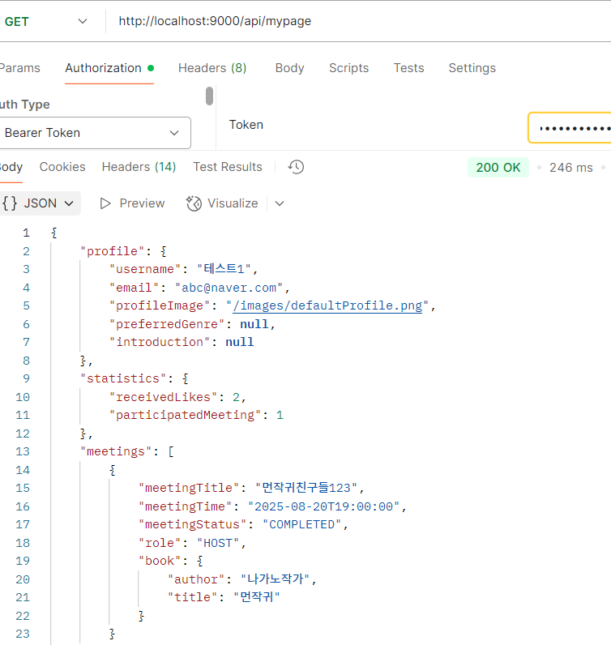

# 📅 2025-08-15 회고

> **북적북적(BookJuk)** 프로젝트 마이페이지 정보 조회 api controller 작성 및 테스트

## 🧭 오늘 논의한 주요 내용

* 마이페이지 정보 조회 api controller 작성 및 테스트

## 🚩 내일 작업할 내용

* 마이페이지 프로필 정보 수정 기능 구현
---

## ✅ 마이페이지 정보 조회 api controller
dto, service 구현과 테스트 모두 완료하여 api controller를 작성하고   
포스트맨을 활용하여 api 테스트를 진행했다.    
```
api
public class MyPageController {

    private final MyPageService myPageService;

    @GetMapping
    public ResponseEntity<?> getMyPage(@AuthenticationPrincipal String email) {
        MyPageResponse response = myPageService.getMyPage(email);
        log.info("사용자 정보 조회 완료: {}", response.getProfile().getUsername());
        return ResponseEntity.ok(response);
    }

}
```

## ✅ 마이페이지 정보 조회 postman 테스트
   


---

## 💭 8/15 일 회고
처음에는 미리 만들어둔 더미 데이터로 테스트를 쉽게 할 수 있을 거라고 생각했다.   
실제로 컨트롤러 작성할 때만 해도, 데이터만 준비되어 있으면 금방 검증이 가능할 거라 기대했다.   
하지만 인증 기능을 붙이고 나서 컨트롤러의 파라미터 값도 변경되고   
단순한 더미 데이터만으로는 인증 정보를 얻을 수 없어서, 결국 테스트가 막히는 경험을 했다.   
그 과정에서 "인증이 추가되면 테스트 환경도 같이 설계해야 한다"는 점을 깨달았으며   
junit5 테스트 대신 postman을 활용하여 api 테스트를 진행했다.


