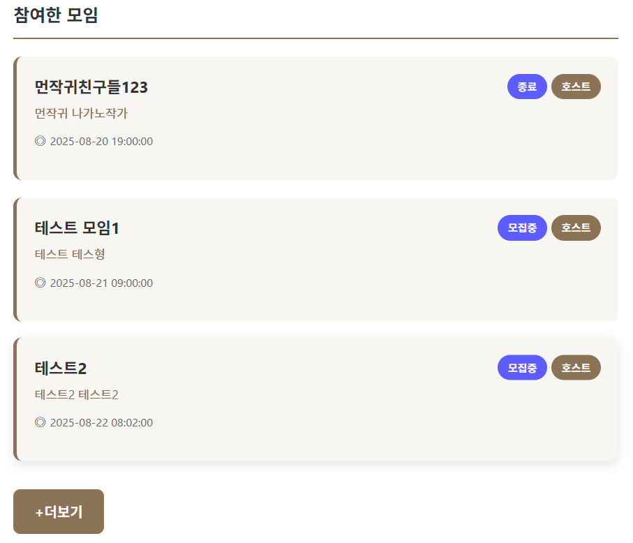

# 📅 2025-08-20 회고

> **북적북적(BookJuk)** 프로젝트 마이페이지 페이징 기능 추가

## 🧭 오늘 논의한 주요 내용

* 마이페이지 참여 모임 정보 단 페이징 기능 추가
* 프로젝트 발표 문서 작성 및 산출물 정리

## 🚩 내일 작업할 내용

* 프로젝트 발표

---

## ✅ 마이페이지 참여 모임 정보 단 페이징 기능 추가 
참여 모임의 개수가 3개 이상 넘어가면 쌓인 모임 리스트 때문에 스크롤이 길어져 ux를 해치고 있었다.   
MVP 구현 완료, 버그 수정 완료 하여 페이징 처리 기능을 추가하기로 결정했다.   

   

기존에는 마이페이지 진입했을 때 한 번의 조회로 사용자 정보 + 모임 정보 + 통계 정보를 하나의 API 로 가져오게 코드를 작성했다.   
페이지 기능 추가로 API를 사용자 정보 + 통계 정보만 조회하는 API 와 참여 모임 정보만 조회하는 API 두가지로 분리했다.   

API 분리로 명세서를 새롭게 작성했고 백엔드 코드와 프론트 엔드 코드도 수정했다.   

1. 백엔드 코드 수정
- MyPageResponseDto 수정   
참여 모임 정보를 받아오던 MeetingInfoDto 를 필드와 정적 팩토리 메소드에서 제거했다.
```
    public class MyPageResponse {
    
    
        private UserInfoDto profile;
        private StaticsInfoDto statistics;
    
    
        // 마이페이지 응답 dto로 바꾸는 정적 팩토리 메소드
        public static MyPageResponse of(UserInfoDto profile, StaticsInfoDto statistics) {
    
            return MyPageResponse.builder()
                    .profile(profile)
                    .statistics(statistics)
                    .build();
        }
    }
```
- MyPageService 비즈니스 로직 수정   
인증된 사용자 이메일 ->  사용자 찾기 -> 사용자 정보 획득 -> 사용자 id로 참여 모임을 조회해오던 로직을 페이징 처리를 위해 해당 로직에서 분리했다.   
```
    /**
     * 마이페이지 진입 정보 조회(디폴트) 로직입니다.
     * @param email - 로그인한 유저가 제시한 토큰에서 파싱한 이메일 정보
     * @return - 프론트 단에 전달할 유저 정보, 유저 모임 정보, 유저의 모임 참여, 좋아요 통계 정보를 반환합니다.
     */
    public MyPageResponse getMyPage(String email) {

        // 1. 사용자 이메일로 유저 정보 가져오기
        User user = getUserByEmail(email);

        // 조회된 유저 정보를 마이페이지 응답에 필요한 dto 로 변경
        UserInfoDto profile = UserInfoDto.from(user);


        // 3. 유저의 모임 참여, 좋아요 통계 정보를 가져오기
        Long userId = user.getId();
        Long meetingCount = meetingParticipantRepository.countMeetingByUserId(userId);
        StaticsInfoDto stats = getStatsByUserId(userId, meetingCount);

        return MyPageResponse.of(profile, stats);

    }
    
    /**
     * 사용자의 id 정보로 받은 좋아요 개수를 조회하고 참여한 리스트 개수와 함께 필요한 정보만 반환하는 메소드입니다.
     * @param id - 이메일 정보로 찾은 유저 id
     * @param count - 참여 리스트의 size
     * @return - 유저 id 정보롤 찾은 좋아요 개수와 참여 리스트의 개수를 받아 필요한 정보만 매핑한 dto
     */
    private StaticsInfoDto getStatsByUserId(Long id, Long count) {
        Long reviewCount = meetingReviewRepository.countReviewByUserId(id);
        return StaticsInfoDto.of(reviewCount, count);
    }
```
기존에는 사용자 id로 가져온 모임 정보에서 바로 모임 참여 개수를 확인 할 수 있었는데   
변경된 로직에서는 사용자 id로 모임 참여 정보 개수를 조회하게 수정했고 반환 타입도 int -> Long 으로 변경되었다.   
반환타입이 변경됨에 따라 StaticsInfoDto 의 meetingCount 타입도 Long 으로 변경되었다.   

참여 모임 정보만 조회해오는 비즈니스 로직을 새롭게 작성하였다.
```
    /**
     * 사용자의 id 정보로 참여한 미팅 정보를 가져오고 필요한 정보만 반환하는 메소드입니다.
     * @param email - 토큰 정보로 부터 가져온 사용자 식별 이메일
     * @return - 유저의 id 로 참여한 미팅 정보를 리스트로 받은 후 필요한 정보만 dto 로 매핑한 리스트
     */
    public Page<MeetingInfoDto> getMyMeetings(String email, Pageable pageable) {
        // 이메일로 사용자 정보 가져요기
        User user = getUserByEmail(email);
        Long id = user.getId();

        // 사용자 id 정보로 참여한 미팅 정보 반환
        Page<MeetingParticipant> meetingParticipants =
                meetingParticipantRepository.findMeetingsByUserId(id, pageable);

        // 반환된 페이지 리스트를 dto 로 매핑
        return meetingParticipants.map(MeetingInfoDto::from);
    }
```
- MeetingParticipantCustom, MeetingParticipantRepositoryImpl 에 필요한 메소드 추가   
controller -> service -> repository 로 페이징 처리를 위해 Pageable 객체를 전달하고   
타입도 page 타입으로 변경하였다.
```
    public interface MeetingParticipantCustom {
    
        // 미팅 id로 미팅 참여자 찾기
        List<User> findMeetingParticipantsByMeetingId(Long id);
    
        // 유저 id로 참여 미팅 리스트 반환
        Page<MeetingParticipant> findMeetingsByUserId(Long id, Pageable pageable);
    
        // 유저 id도 참여 미팅 리스트의 총 개수 반환
        Long countMeetingByUserId(Long id);
    }
    
    public class MeetingParticipantRepositoryImpl implements MeetingParticipantCustom {
      
        ...
    
        // 유저 id로 참여한 미팅 id 반환
        @Override
        public Page<MeetingParticipant> findMeetingsByUserId(Long id, Pageable pageable) {
    
            List<MeetingParticipant> contents = factory
                    .selectFrom(meetingParticipant)
                    .where(meetingParticipant.participant.id.eq(id))
                    .offset(pageable.getOffset())   // 시작 위치
                    .limit(pageable.getPageSize())  // 페이지 크기
                    .fetch();
    
            Long total = factory
                    .select(meetingParticipant.count())
                    .from(meetingParticipant)
                    .where(meetingParticipant.participant.id.eq(id))
                    .fetchOne();
    
            return new PageImpl<>(contents, pageable, total);
        }
    
        // 유저 id로 참여한 미팅의 총 개수 반환
        @Override
        public Long countMeetingByUserId(Long id) {
            return factory
                    .select(meetingParticipant.meeting.count())
                    .from(meetingParticipant)
                    .where(meetingParticipant.participant.id.eq(id))
                    .fetchOne();
        }
    
    }
```
- MyPageController 참여 모임 정보만 조회해오는 Get 요청 메소드 추가   
페이지는 0번 부터 시작 3개씩 잘라서 페이징 처리를 진행하게 작성했다.
```
    @GetMapping("/meetings")
    public ResponseEntity<?> getMyMeetings(
            @AuthenticationPrincipal String email,
            @PageableDefault(page = 0, size = 3, sort = "createdAt", direction = Sort.Direction.DESC) Pageable pageable
    ) {
        Page<MeetingInfoDto> response = myPageService.getMyMeetings(email, pageable);
        return ResponseEntity.ok(ApiResponse.success("마이페이지 나의 참여 모임 정보 조회를 성공했습니다.", response));
    }
```

2. 프론트 엔드 코드 수정

