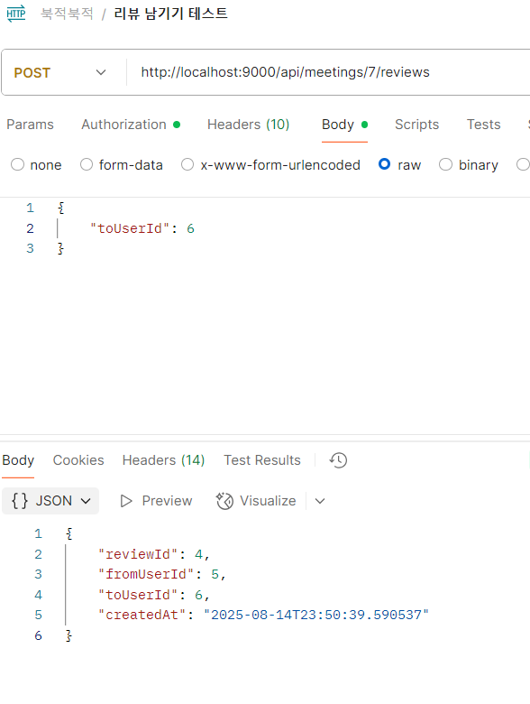
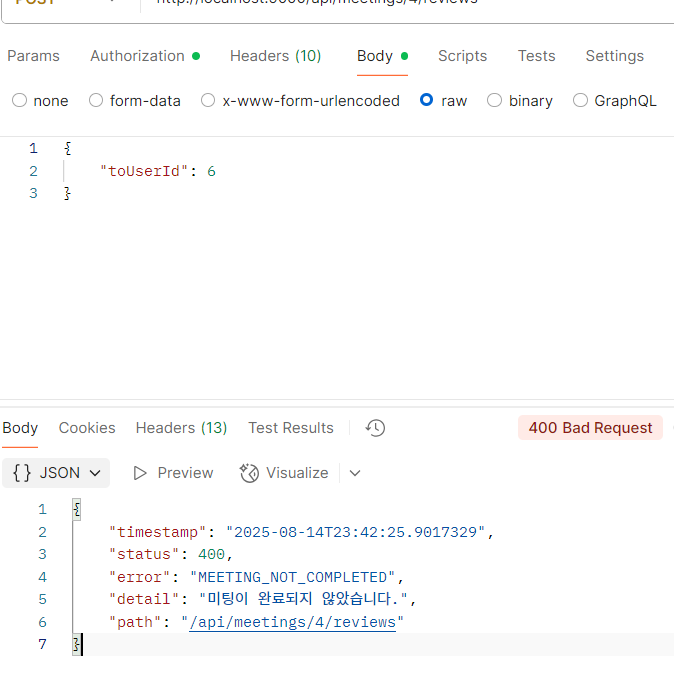
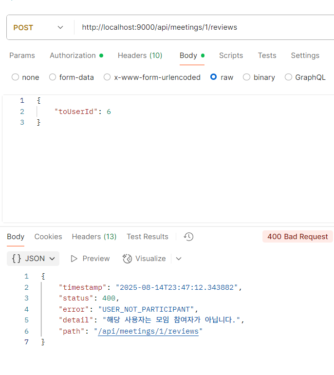
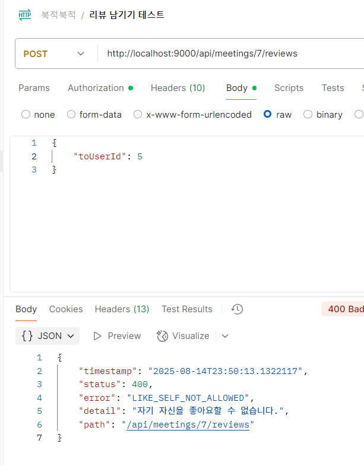
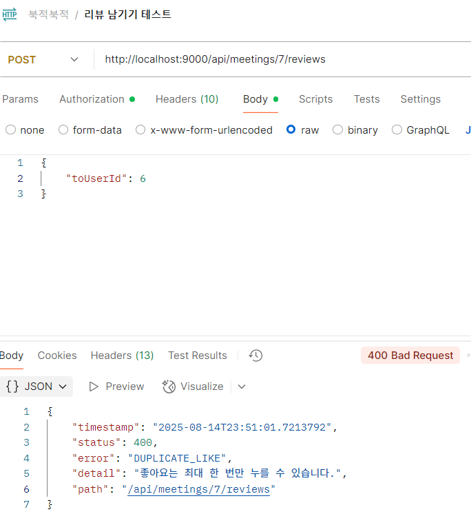

# 📅 2025-08-14 회고

> **북적북적(BookJuk)** 프로젝트 리뷰(좋아요) api controller 작성 및 api 포스트맨 테스트

## 🧭 오늘 논의한 주요 내용

* 리뷰(좋아요) api controller 작성

## 🚩 내일 작업할 내용

* 마이페이지 정보 조회 api controller 작성 및 테스트

---

## ✅ 리뷰(좋아요) api controller 작성
dto, service 구현과 테스트 모두 완료하여 api controller를 작성하고   
포스트맨을 활용하여 api 테스트를 진행했다.   
controller를 작성하면서 dto와 service 단 메소드의 파라미터를 수정했다.   
```
api
@PostMapping("/{meetingId}/reviews")
public ResponseEntity<?> createReview(
        @PathVariable Long meetingId,
        @AuthenticationPrincipal String email,
        @RequestBody @Valid ReviewRequest request
        ) {

    // 스프링 시큐리티 컨텍스트에서 인증된 사용자의 정보(email)로 사용자 객체를 조회
    User user = userService.findUser(email);
    Long reviewerId = user.getId();

    ReviewResponse response = reviewService.createReview(meetingId, reviewerId, request);

    log.info("{} 모임에서 {}님이 {}님에게 리뷰를 남겼습니다.", meetingId, reviewerId, request);
    return ResponseEntity.ok(response);
}
```

## ✅ 리뷰(좋아요) postman 테스트
  
   
   
   


---

## 💭 8/14 일 회고
api 명세서 기반으로 dto를 설계하고, 유저플로우 기반으로 비즈니스 로직을 빠르고 오류없이 구현할 수 있었다. 
하지만 컨트롤러에서 어떤 파라미터를 받을지 고려하지 않고 먼저 서비스를 만들어서 수정이 필요했다.   
앞으로는 서비스 로직만 보는 것이 아니라 컨트롤러, dto, 연관되는 계층들을 함께 고려하면서 설계해야 함을 배웠다.