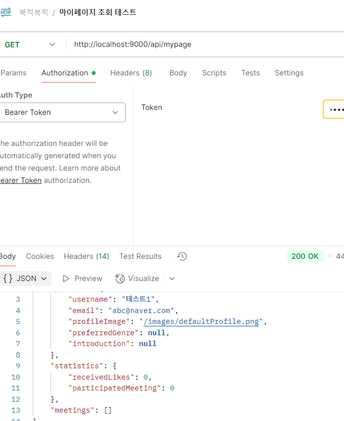
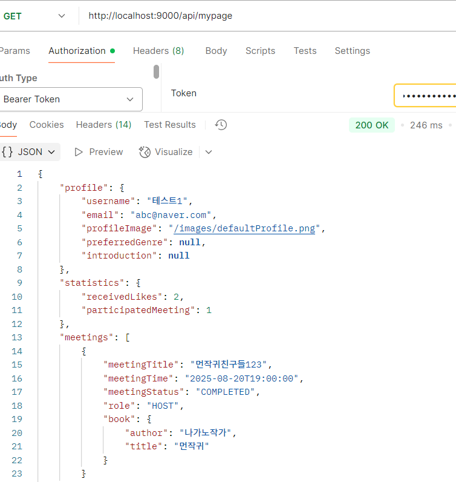

# 📅 2025-08-15 회고

> **북적북적(BookJuk)** 프로젝트 마이페이지 정보 조회 api controller 작성 및 테스트

## 🧭 오늘 논의한 주요 내용

* 마이페이지 정보 조회 api controller 작성 및 테스트

## 🚩 내일 작업할 내용

* 마이페이지 프로필 정보 수정 기능 구현
---

## ✅ 마이페이지 정보 조회 api controller
dto, service 구현과 테스트 모두 완료하여 api controller를 작성하고   
포스트맨을 활용하여 api 테스트를 진행했다.    
```
api
public class MyPageController {

    private final MyPageService myPageService;

    @GetMapping
    public ResponseEntity<?> getMyPage(@AuthenticationPrincipal String email) {
        MyPageResponse response = myPageService.getMyPage(email);
        log.info("사용자 정보 조회 완료: {}", response.getProfile().getUsername());
        return ResponseEntity.ok(response);
    }

}
```

## ✅ 마이페이지 정보 조회 postman 테스트
   


---

## 💭 8/15 일 회고
이전에 테스트 해둔 더미 테이터가 있어서 쉽게 테스트 될 줄 알았sㄴ

